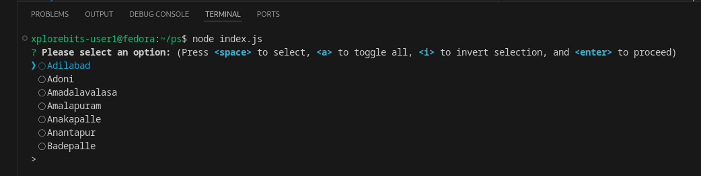
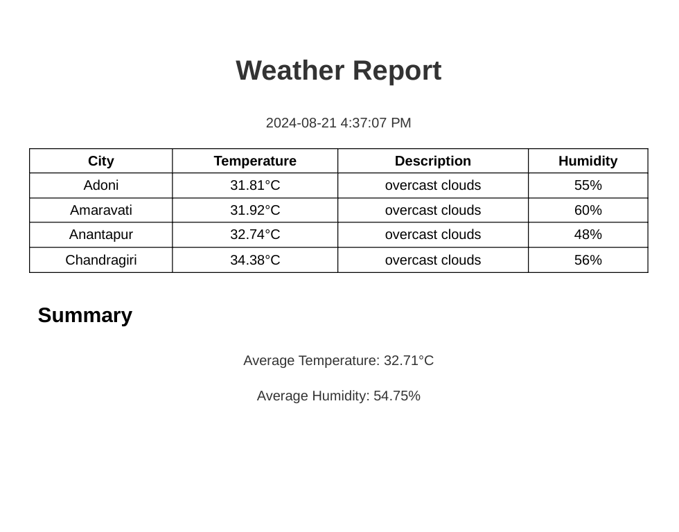

# Weather Report Generator for Andhra Pradesh Cities: Setup Guide

## Project Setup

### 1. Clone the Repository
First, clone the project repository from GitHub using HTTPS:
```
git clone https://github.com/kmd-shafi/weather-data.git
```
### 2. npm install
This will install all dependencies listed in the package.json file, including:
```
npm install
```
### 3. Environment Setup
Create a .env file in the root directory of the project and add your OpenWeatherMap API key:
APIKEY=your_openweathermap_api_key_here

### 4. Running the Application
Once setup is complete, run the application using:
```
node index.js
```
## Weather Report Generator
This Node.js project creates a weather report for selected cities in Andhra Pradesh, India. It fetches weather data from the OpenWeatherMap API and generates a PDF report.
Key Features

City selection from Andhra Pradesh using a checkbox prompt
Fetches real-time weather data for selected cities
Generates a PDF report with Individual city weather information
Average temperature and humidity across selected cities
Timestamp of report generation

### 1. City Selection


To select the city name enter the space button
To select the next city enter up arrow and down arrow
Click Enter

### 2. PDF Generation
In root directory of the project the report folder save the pdf's

